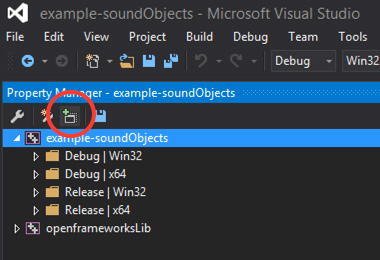
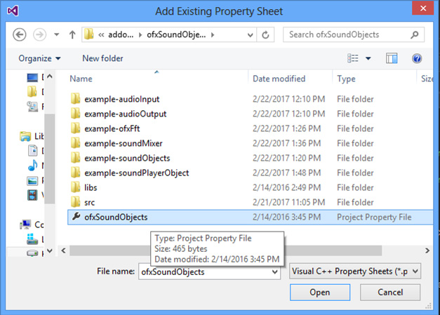

ofxSoundObjects
=====================================

This is an addon version for the ofSoundObject implementation originally conceived at the 2013 OFDev Conference held at the Yamaguchi Center For Arts and Media, Japan.
The developers involved in this were:

* [Adam Carlucci](https://github.com/admsyn/)
* [Marek Bareza](https://github.com/mazbox)
* [Arturo Castro](https://github.com/arturoc)
* [Roy Macdonald](https://github.com/roymacdonald/)

The original development branch can be found [here](https://github.com/admsyn/openFrameworks/tree/feature-sound-objects).

Made as addon by Roy Macdonald.

This addon includes [libaudiodecoder](https://github.com/asantoni/libaudiodecoder), which is licensed under MIT.
Current commit: 9fc6ac944a67b74cfcaf19a41e00c6190561aae8

## IMPORTANT.
#### VisualStudio2015Community
To be able to use this addon with visual studio you need to do the following whenever updating or creating a project with project generator.

1. Use project generator as you normaly would (add ofxSoundObjects from the dropdown menu).
* Once done, open the project in VS.
* Go to "View > Property Manager".
* In the Properties Manager select your project and clic on the "Add Existing Property Sheet" button. (shown in the image below).

	

* Open the file ofxSoundObjects.props that is in this addons folder. (shown in the image below).
  
	
	
That's all.

## Explanation
#### The ofxSoundObject
* Is a class for working with audio.
* It has an input and and output.
* By itself does nothing, it will just passthrough audio, yet it will buffer the audio data instead of passing it straight out. 
* It is intended to be extended uppon to become useful.
* Any two ofxAudioObject inherited classes can connect between them. 

### Usage

When inheriting from ofxSoundObject the only function to override is 

    void process(ofSoundBuffer &input, ofSoundBuffer &output)

When you have two instances from classes that inherit from ofxSoundObject, `soundObject1` and `soundObject2;`
when you say 
    
    soundObject1.connectTo(soundObject2);

it means that the audio data from  soundObject1 (and processed if so) is sent soundObject2, so the latter processes it and sends it to whatever it is connected to.

You can connect an ofxSoundObject directly to an ofSoundStream output, so your sound goes out to your sound device.

    soundStream.setOutput(soundObject);

To get sound input from your audio device you need to make an instance of ofxSoundInput, set it as the input for the sound stream and connect it to the rest of the sound objects. 

    soundStream.setInput(soundInput);
    soundInput.connectTo(whateverElseSoundObject);

The `connectTo` method returns a reference to the object being connected to, which allows to connect any ammount of objects on a single declaration.

    soundObject1.connectTo(soundObject2).connectTo(soundObject3).connectTo(soundObject3).connectTo(soundObject4);

When you want to draw the sound buffer data somehow make sure you use an ofMutex to avoid threads colliding. Check the waveformDraw included sound object and use as guideline.

## Examples
#### AudioInput
This will take the input audio data from the sound card, plot it in the display and send it to the output.
Notice that the waveformDraw class uses a mutex for avoiding crashes as different threads try to access and modify the object audio data.

WARNING: This example can create an extreme acoustic sound feedback, so be careful with the sound levels before running it.

#### AudioOutput
This will generate a sine wave and output it to the sound output.
The sine wave's parameters ar controlled via mouse position;

#### SoundObjects
This class has a NoiseGenerator, a LoPassFilter and a DigitalDelay instances, all of which inherit from ofxSoundObject. Their names are quite self explaning.
Chech how these are connected to each other
     
     noise.connectTo(filter).connectTo(delay).connectTo(output);

which means that noise is generated, the filtered by the loPassfilter, then delay (echo) is applied to finally being sent to the sound output.

#### SoundPlayerObject
This makes use of the ofxBasicSoundPlayer, that is a sound file player that extends ofxSoundObject, which is not so basic at all, thus you can connect it to any other object and process and do whatever you might want to do with the playedback sound data. See below a more thorough explanation of this sound player. When starting this example a file dialog will pop up in which you should select an audio file to be played back.

#### SoundMixer
It makes use of the ofxSoundMixer object. It loads some audiofiles and plays them back. There's a gui in which you can modify the volume of each mixer channel.

#### ofxFft
it uses [ofxFft](https://github.com/kylemcdonald/ofxFft) to perform a Fast Fourier Transform and visualize it. You can change the input of it in runtime, choosing from a audio file playback, sine wave generator or live input.

## Included soundObjects
The following are the classes that inherit from ofxSoundObject that are included in this addon. Use this as guidelines for implementing your own.

#### DigitalDelay

It will delay sound and put it into a feedback loop creating an "echo" kind of effect. It is a really common effect for sound manipulation.

Parameters available:

* **Delay**: The amount of samples that will be delayed, or how much time (samples) will be between each echo repetition.
* **Mix**: The mix amount of original sound with the delayed/processed sound. 
* **Feedback**: How much of the delayed sound is feedbacked. This is also the amount of repetitions. 0 means no repetitions. 1 means infinite repetitions. 

This object:

* Intakes sound.
* Processes sound.
* Outputs sound.

#### LowPassFilter.h

This is a basic kind of equalizer. It will only let pass through sounds that are below a certain frequency, which is user defined.

Parameters available:

* **Cutoff**: this is the limit frequency.
* **Resonance**: amount of emphasis applied to frequencies that are just before the cutoff frequency.

This object:

* Intakes sound.
* processes sound.
* Outputs sound.

#### NoiseGenerator.h

This will create white-ish noise. It will just put random valued samples into the buffer.

**No parameters available.**

This object:

* DOES NOT intake sound.
* Generates sound.
* Outputs sound.

#### SineWaveGenerator.h

This will create a sine wave signal and place it into the buffer.

Parameters available:

* **Frequency**: The sine wave signal frequency
* **Amplitude**: How "loud" this signal will be.
* **Phase**: The amount of offset that with signal will have. 

This object:

* DOES NOT intake sound.
* Generates sound.
* Outputs sound.

#### waveformDraw.h

This draws the waveform of the sound being input to it.
It inherits from ofRectangle which is used for the drawing area.
Parameters available:

* **x, y, width and height:** cordinates and size of the area where this will get drawn. 

This object:

* Intakes sound.
* DOES NOT generates or process sound. It passes through.
* Outputs sound.

## Other classes included this addon
The following are some useful classes included with this addon.

#### ofxSoundFile

This class provides access to sound data from a variety of sound file formats. It supports the most common ones like .mp3, .acc, .aiff and .wav on all systems, plus several others depending on the system. It makes use of [libaudiodecoder](http://www.oscillicious.com/libaudiodecoder) for MacOsX, iOS and Windows and [libsndfile](http://www.mega-nerd.com/libsndfile/) for Linux.
This class will decode data and make it accessible using the ofSoundBuffer instances.
It provides basic 16bit wav sound file writing.

#### ofxBasicSoundPlayer

This is a completely implemented sound player. It makes use of ofxSoundFile to access sound files. It will deal with passing the required data to the sound stream, interpolating it if necesary and provide all the common sound player functionalities. It is not basic at all but nobody came with a better name when develiping it.

#### ofxSoundMixer

This will allow you to mix the sound from several ofxSoundObjects connected to it.
It inherits from ofxSoundObject so it is completely compatible with other ofxSoundObjects. 
It is really simple. Just allows volume adjustment per channel but you can extend it to make a really fancy sound mixer, just limited by your computer capabilities (not completely sure but thereticaly it should be true).

#### ofxSoundInput

You need to use this to connect the sound device input to a soundObject

